# Cross-Chain Price Feed Oracle

Cross-chain price oracle using Wormhole Executor. Broadcast token prices to multiple chains simultaneously.

## Features

✅ Multi-chain broadcasting (1 transaction → N chains)  
✅ Array-based price updates  
✅ Role-based access control  
✅ Peer validation & replay protection

## Quick Start

```bash
forge install && npm install
forge test

# Deploy contracts
forge script script/DeployPriceFeedSender.s.sol --rpc-url $RPC --private-key $KEY --broadcast
forge script script/DeployPriceFeedReceiver.s.sol --rpc-url $RPC --private-key $KEY --broadcast
```

## Architecture

```mermaid
---
config:
  layout: dagre
---
flowchart LR
 subgraph Source["🔷 Ethereum"]
        User(("👤 Price Feeder Admin"))
        Sender["PriceFeedSender"]
        ExecSrc["Executor"]
        BridgeSrc["CoreBridge"]
        feedSrc["Price Feed"]
  end
 subgraph Guardians["🪱 Guardian Network"]
        GuardianNet["Guardians + VAA"]
  end
 subgraph Aptos["🔵 Base"]
        ExecDst1["Executor"]
        Receiver1["PriceFeedReceiver"]
        BridgeDst1["CoreBridge"]
        feedDst1["Price Feed"]
  end
 subgraph Polygon["🟪 Polygon"]
        ExecDst2["Executor"]
        Receiver2["PriceFeedReceiver"]
        BridgeDst2["CoreBridge"]
        feedDst2["Price Feed"]
  end
 subgraph BNYVerifier["🏦 BNY Verifier"]
        Verifier["Offchain Verifier"]
  end
 subgraph Executor["🪓 Executor Off-chain Component"]
        OffchainExecutor["Executor Service"]
  end
    User -- "2. updatePrices + signedQuote + gas" --> Sender
    User -- "1. Request Executor Quotes" --> OffchainExecutor
    Sender -- "2.a. Request Execution + signedQuote" --> ExecSrc
    Sender -- "2.b. Send message" --> BridgeSrc
    Sender -- Set Price --> feedSrc
    ExecSrc -. Queue Execution .-> OffchainExecutor
    OffchainExecutor -- "3. Execute on Finality" --> ExecDst1 & ExecDst2
    BridgeSrc -- emit Message --> GuardianNet
    GuardianNet -. Signed VAA (listen) .-> OffchainExecutor
    ExecDst1 -- "3.a. Call executeVAA()" --> Receiver1
    ExecDst2 -- "3.a. Call executeVAA()" --> Receiver2
    Receiver1 <-- "3.b. Verify VAA" --> BridgeDst1
    Receiver2 <-- "3.b. Verify VAA" --> BridgeDst2
    Receiver1 -- "4.b. Update Price" --> feedDst1
    Receiver2 -- "4.b. Update Price" --> feedDst2
    Sender -. "2.c. Request Verification" .-> Verifier
    Verifier -- "4.a. Attest" --> Receiver1 & Receiver2

    feedSrc@{ shape: cyl}
    feedDst1@{ shape: cyl}
    feedDst2@{ shape: cyl}
    style User fill:#e1f5fe,stroke:#01579b,stroke-width:4px,stroke-dasharray: 5
    style Sender fill:#E1BEE7
    style ExecSrc fill:#FFE0B2
    style BridgeSrc fill:#C8E6C9
    style feedSrc fill:#FFF9C4
    style GuardianNet fill:#e8f5e9,stroke:#2e7d32,stroke-width:2px
    style ExecDst1 fill:#FFE0B2
    style Receiver1 fill:#E1BEE7
    style BridgeDst1 fill:#C8E6C9
    style feedDst1 fill:#FFF9C4
    style ExecDst2 fill:#FFE0B2
    style Receiver2 fill:#E1BEE7
    style BridgeDst2 fill:#C8E6C9
    style feedDst2 fill:#FFF9C4
    style OffchainExecutor fill:#FFE0B2
    style Guardians stroke:#E1BEE7,color:#AA00FF
    linkStyle 9 stroke:#D50000,fill:none
    linkStyle 10 stroke:#D50000,fill:none
    linkStyle 11 stroke:#D50000,fill:none
    linkStyle 12 stroke:#D50000,fill:none
    linkStyle 13 stroke:#D50000,fill:none
    linkStyle 14 stroke:#2962FF,fill:none
    linkStyle 15 stroke:#2962FF,fill:none
    linkStyle 16 stroke:#2962FF,fill:none
    linkStyle 17 stroke:#2962FF,fill:none
    linkStyle 18 stroke:#2962FF,fill:none
```



**PriceFeedSender** - Broadcasts to multiple chains in one transaction  
**PriceFeedReceiver** - Validates peer, stores prices, emits events

| Chain        | Wormhole ID | CoreBridge      | Executor        |
| ------------ | ----------- | --------------- | --------------- |
| Sepolia      | 10002       | `0x4a8bc80E...` | `0xD0fb39f5...` |
| Base Sepolia | 10004       | `0x79A1027a...` | `0x51B47D49...` |
| Polygon Amoy | 10007       | `0x6b9C8671...` | `0x7056721C...` |

## Setup Peers

Use the SetupPeers script to configure peer relationships:

```bash
# Set up peers on each chain
forge script script/SetupPeers.s.sol:SetupPeersScript \
  --rpc-url https://ethereum-sepolia.publicnode.com \
  --private-key $PRIVATE_KEY_SEPOLIA --broadcast

forge script script/SetupPeers.s.sol:SetupPeersScript \
  --rpc-url https://sepolia.base.org \
  --private-key $PRIVATE_KEY_BASE_SEPOLIA --broadcast

forge script script/SetupPeers.s.sol:SetupPeersScript \
  --rpc-url https://rpc-amoy.polygon.technology \
  --private-key $PRIVATE_KEY_POLYGON_AMOY --broadcast --legacy
```

**Note**: Script uses SDK's `toUniversalAddress()` for proper Wormhole Universal Address format.

## Usage

### Multi-Chain Price Update (New!)

Send prices to multiple chains in a single transaction:

```solidity
// Solidity: updatePrices(tokenNames, prices, targets[])
struct TargetChainParams {
    uint16 chainId;        // Wormhole chain ID
    uint128 gasLimit;      // Gas limit for execution
    uint256 totalCost;     // Cost including executor fee
    bytes signedQuote;     // Signed quote from executor
}

string[] memory tokens = ["bitcoin", "ethereum"];
uint256[] memory prices = [50000e8, 3000e8];

TargetChainParams[] memory targets = new TargetChainParams[](2);
targets[0] = TargetChainParams(10004, 500000, 0.005 ether, quote1);  // Base Sepolia
targets[1] = TargetChainParams(10007, 500000, 0.005 ether, quote2);  // Polygon Amoy

priceFeedSender.updatePrices{value: 0.01 ether}(tokens, prices, targets);
```

TypeScript (E2E):

```typescript
await sendPriceUpdate(
    config.sepolia,
    [config.baseSepolia, config.polygonAmoy], // Multiple targets!
    ['bitcoin', 'ethereum'],
    [50000n * 10n ** 8n, 3000n * 10n ** 8n]
);
```

Query prices on any chain:

````bash
cast call $PRICE_FEED_BASE_SEPOLIA "prices(string)" "bitcoin" --rpc-url https://sepolia.base.org
```solidity
// Multi-chain broadcast
TargetChainParams[] memory targets = new TargetChainParams[](2);
targets[0] = TargetChainParams(10004, 500000, 0.005 ether, quote1);
targets[1] = TargetChainParams(10007, 500000, 0.005 ether, quote2);

priceFeedSender.updatePrices{value: 0.01 ether}(
    ["bitcoin", "ethereum"],
    [50000e8, 3000e8],
    targets
);
````

```bash
# Query prices
cast call $RECEIVER "prices(string)" "bitcoin" --rpc-url $RPC

# E2E test
npm run e2e:test
```

## Resources

-   [Wormhole Docs](https://wormhole.com/docs)
-   [Solidity SDK](https://github.com/wormhole-foundation/wormhole-solidity-sdk)
-   [Executor Explorer](https://wormholelabs-xyz.github.io/executor-explorer)
